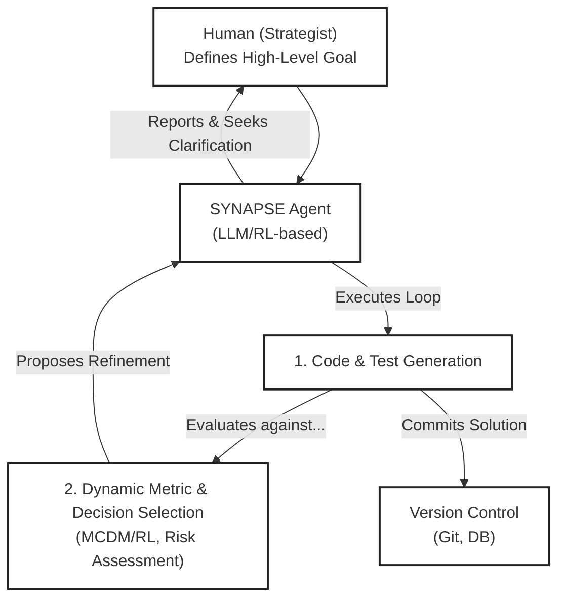

# SYNAPSE: AI-Driven Adaptive Software Engineering

This repository contains the research paper and the experimental prototype for the **SYNAPSE (Synthetic-data Native Adaptive Process for Software Engineering)** framework.

[](https://www.kaggle.com/code/sashachernysh/synapse)
[](https://opensource.org/licenses/MIT)


## 1. Overview

SYNAPSE is a novel framework for software development that employs an autonomous AI agent to orchestrate the entire engineering lifecycle. Unlike traditional methods that rely on static metrics, the SYNAPSE agent dynamically adapts its own success criteria and decision-making models at each iteration.

The core innovation is **adaptive governance**: the agent moves beyond simple code generation to strategically manage trade-offs between performance, security, and maintainability, guided by high-level project goals.

This repository includes:
*   `paper.md`: The full research paper.
*   `synapse_experiment/`: A Python-based simulation to validate the framework's core hypotheses.

## 2. Conceptual Architecture

The SYNAPSE agent operates in a continuous feedback loop:



## 3. The Synthetic Experiment

We validate SYNAPSE using a synthetic experiment centered on a resource-constrained pathfinding problem for a simulated drone. The goal is to find an optimal path that balances delivery time, energy consumption, safety, and payload integrity.

The experiment compares two agents:
1.  **Static Agent:** A control group agent that uses a fixed set of metrics.
2.  **SYNAPSE Agent:** An experimental agent that dynamically adapts its metrics and strategies based on the scenario.

### 3.1. Running the Experiment

**Prerequisites:**
*   Python 3.11+

**Setup:**

1.  **Clone the repository:**
    ```bash
    git clone https://github.com/chernistry/synapse.git
    cd synapse/synapse_experiment
    ```

2.  **Create and activate a virtual environment:**
    ```bash
    python3 -m venv venv
    source venv/bin/activate  # On Windows: venv\Scripts\activate
    ```

3.  **Install dependencies:**
    ```bash
    pip install -r requirements.txt
    ```

**Execution:**

1.  **Run the main experiment script:**
    ```bash
    python main.py
    ```

2.  **View the results:**
    The script will generate a timestamped `.csv` file (e.g., `results/experiment_results_YYYYMMDD_HHMMSS.csv`) in the `results` directory.

3.  **Analyze the results with Jupyter:**
    For a deep dive into the results, including visualizations and performance comparisons, open and run the analysis notebook:
    ```bash
    jupyter notebook synapse_experiment/analysis_notebook.ipynb
    ```

## 4. Citing This Work

If you find this work useful, please cite our paper:

```bibtex
@misc{yourname2024synapse,
      title={SYNAPSE: A Framework for AI-Driven Adaptive Software Engineering}, 
      author={Your Name and Collaborators},
      year={2024},
      eprint={24XX.XXXXX},
      archivePrefix={arXiv},
      primaryClass={cs.SE}
}
```

## 5. License

This project is licensed under the MIT License - see the [LICENSE](LICENSE) file for details. 