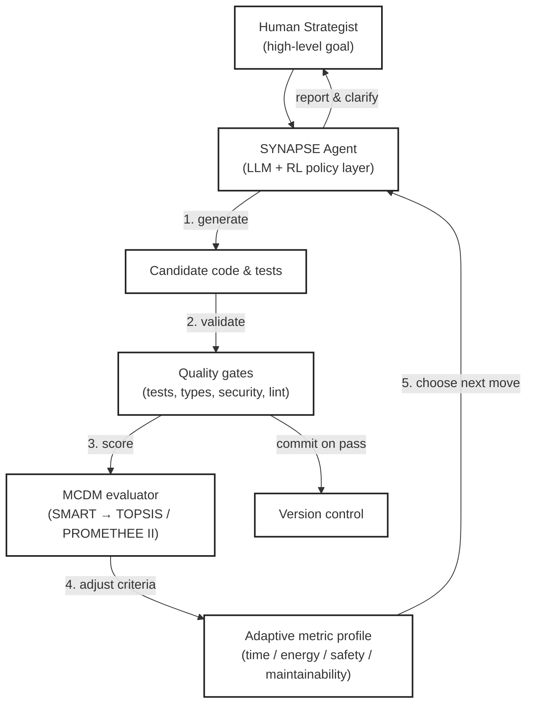

<div align="center">

# SYNAPSE

### Where I learned that the orchestrator is the product.

<sub>A 2025 research prototype of an autonomous agent that adapts its own success criteria. Preserved here as the conceptual origin of <a href="https://bernstein.run">Bernstein</a>.</sub>

<br>

[](https://www.kaggle.com/code/sashachernysh/synapse)
[](#the-synthetic-experiment)
[](https://chernistry.github.io/synapse/)
[](https://python.org)
[](https://opensource.org/licenses/MIT)

Created by [Alex Chernysh](https://alexchernysh.com) &middot; [GitHub](https://github.com/chernistry)

</div>

---

> *"We have seen our best efforts toward conceptual integrity bear fruit beyond our hopes."* — Fred Brooks, *The Mythical Man-Month*

## Why this exists

This is the 2025 prototype of an idea I later shipped in production. It's preserved here as the conceptual origin of how I think about adaptive AI systems.

The premise was simple and, at the time, unfashionable: most agent frameworks were chasing better LLM prompts, but the interesting unsolved problem was the *control plane around the LLM* — the loop that decides what to optimize for, when to switch criteria, and how to back out of bad calls. I didn't have the phrase "control plane" in 2025; the paper calls it adaptive governance. SYNAPSE — *Synthetic-data Native Adaptive Process for Software Engineering* — was my attempt to sketch that loop on paper and then poke at one corner of it with a synthetic experiment.

The experiment is small. The framework is conceptual. The lineage is real: most of the architectural instincts I rely on today (deterministic schedulers, MCDM-driven scoring, file-based state, agents as short-lived workers) trace back to thinking I did inside this repo.

## April 2026 retrospective

- **[Kotef](https://github.com/chernistry/kotef)** was the first attempt to put SYNAPSE's loop on a real repository. A `planner → researcher → coder → verifier → janitor` flow with durable state in `.sdd/runtime/`, MCP-grounded tools, and resume by thread ID. Single-agent. The metric profile became a quality-gate config.
- **[Bernstein](https://bernstein.run)** is where the *deterministic-control-plane* idea grew up at scale. Same instinct as SYNAPSE — the orchestrator should be code, not an LLM — generalized from one agent to many. 40+ CLI adapters, Apache-2.0, on PyPI. Kotef's lessons about durable state and backlog-driven planning landed there.

The 2025 sketch held up. That's the only claim this repo has earned.

## The framework in one diagram

The agent runs a closed loop: generate a candidate, validate it, score it against the current metric profile, adjust that profile if the scenario warrants it, and pick the next move.


```mermaid
graph TD;
    A["Human Strategist<br/>(high-level goal)"] --> B["SYNAPSE Agent<br/>(LLM + RL policy layer)"];
    B -- "1. generate" --> C["Candidate code &amp; tests"];
    C -- "2. validate" --> D["Quality gates<br/>(tests, types, security, lint)"];
    D -- "3. score" --> E["MCDM evaluator<br/>(SMART → TOPSIS / PROMETHEE II)"];
    E -- "4. adjust criteria" --> F["Adaptive metric profile<br/>(time / energy / safety / maintainability)"];
    F -- "5. choose next move" --> B;
    D -- "commit on pass" --> G["Version control"];
    B -- "report &amp; clarify" --> A;

    style A fill:#fff,stroke:#222,stroke-width:2px
    style B fill:#fff,stroke:#222,stroke-width:2px
    style C fill:#fff,stroke:#222,stroke-width:2px
    style D fill:#fff,stroke:#222,stroke-width:2px
    style E fill:#fff,stroke:#222,stroke-width:2px
    style F fill:#fff,stroke:#222,stroke-width:2px
    style G fill:#fff,stroke:#222,stroke-width:2px
```

The novel piece is step 4. Most agent loops in 2025 picked a fitness function once and held it constant. SYNAPSE re-derives the weight vector at each iteration based on a quick risk read of the current scenario — the same MCDM7 routine (AHP/SMART → DEMATEL → BWM → TOPSIS) I now use elsewhere.

## The synthetic experiment

The conceptual loop above asks for a much bigger evaluation harness than I built. What actually shipped is a single proof-of-concept run: a continuous 2D pathfinding problem under dynamic wind, where two agents try to get a simulated drone from start to goal under conflicting pressures (time, energy, safety, payload integrity).

- **StaticAgent** uses a fixed weight vector across the whole run.
- **SYNAPSEAgent** reads the scenario, picks a metric profile (here: lean into safety because wind makes the corridor noisy), and re-evaluates each step.

The question was narrow: under one adversarial scenario, does adapting the criteria actually change the chosen path in a measurable way?

### Results — `S1_DynamicWind`, single seed

| Agent | Energy | Safety score (lower = safer) | Time | Path found |
|---|---:|---:|---:|:---:|
| StaticAgent  | 170.28 | 3.97 | 59.71 | yes |
| SYNAPSEAgent | 122.32 | 1.24 | 61.50 | yes |

Read carefully: SYNAPSEAgent used **~28% less energy** and scored **~69% better on safety** while taking about **3% longer**. That is one run, one scenario, one seed — a sanity check, not a benchmark. The CSV is committed verbatim at `results/experiment_results_20250708_225100.csv`; nothing has been smoothed.

The point I took away: the adaptive layer behaved exactly as designed on the easy case. Whether it generalizes to richer environments is the open question I answered later by building production systems instead of larger simulators (see *What this became*).

## Repo layout

```
synapse/
├── root/
│   └── synapse_experiment/        # the Python simulation
│       ├── main.py                # entry point: run all scenarios
│       ├── config.yml             # experiment knobs
│       ├── requirements.txt       # numpy, shapely, radon, pytest, ...
│       ├── analysis_notebook.ipynb
│       └── src/
│           ├── agents/            # base_agent, static_agent, synapse_agent
│           ├── llm/               # llama_adapter (Ollama / phi-3.5)
│           ├── simulation/        # continuous_map, drone, map
│           ├── analysis/          # metrics, path_analyzer, reporting
│           └── utils/
├── results/                       # CSV output from real runs
└── docs/                          # static site (GitHub Pages) — the unchanged 2025 paper
```

`root/` is the original 2025 project root, kept as-was. The honest unfinished-ambition list from mid-2025: continuous 2D, Micro-RTS / MiniDoom integration, local Llama-3 / Mistral-7B in the metric-selection loop, mutation testing on the agents, factorial design with Mann–Whitney U + Cliff's δ. None of it shipped here. Some of it shipped elsewhere.

## Quickstart

Prerequisite: Python 3.11 or newer.

```bash
git clone https://github.com/chernistry/synapse.git
cd synapse/root/synapse_experiment

python3 -m venv venv
source venv/bin/activate          # Windows: venv\Scripts\activate

pip install -r requirements.txt
python main.py
```

The run writes a timestamped CSV into `root/synapse_experiment/results/` (the top-level `results/` holds the committed 2025 run). The adaptive step calls a local Ollama `phi3.5:3.8b` if one is running; without it the agent falls back to fixed weights and the run still completes.

The analysis notebook is preserved as-is: it was written for the earlier grid-world output schema and will not run against the committed continuous-run CSV. Read it as a record, not a tool.

## What this became

SYNAPSE was the sketch. The shape it argued for matured across two follow-up projects.

- **[Kotef](https://github.com/chernistry/kotef)** &nbsp;·&nbsp; [github.com/chernistry/kotef](https://github.com/chernistry/kotef) — durable single-agent runner. Took SYNAPSE's loop and put it on real repositories: a `planner → researcher → coder → verifier → janitor` supervisor, file-based state in `.sdd/runtime/`, MCP-aware tool orchestration, resume by thread ID. The reason I trusted that the loop survived contact with file systems.

- **[Bernstein](https://bernstein.run)** &nbsp;·&nbsp; [github.com/chernistry/bernstein](https://github.com/chernistry/bernstein) — multi-agent control plane shipped from the same DNA. What Kotef was for one agent, Bernstein is for many: a Python scheduler decomposes a goal, dispatches short-lived agents (Claude Code, Codex, Gemini CLI, and 40+ more) into isolated git worktrees, verifies output through a janitor, and commits what survives. Apache-2.0, on PyPI, used by people who are not me. Kotef's lessons about durable state and backlog-driven planning live here too.

If you read SYNAPSE → Kotef → Bernstein in order, the family resemblance is the point.

## Reading list

The framing was shaped by, in roughly decreasing order of debt:

- Fred Brooks, *The Mythical Man-Month* (1975) — conceptual integrity as the engineer's first job.
- Hwang & Yoon, *Multiple Attribute Decision Making* (1981) — the TOPSIS lineage that runs through every adaptive-metric routine here.
- Sutton & Barto, *Reinforcement Learning* (2nd ed., 2018) — the policy-iteration framing for the outer loop.
- Brynjolfsson & Mitchell, *What can machine learning do?* (Science, 2017) — economic framing for "where does the human stay in the loop."

## License

[MIT](LICENSE).

---

<sub>Created by <a href="https://alexchernysh.com">Alex Chernysh</a> &middot; <a href="https://github.com/chernistry">GitHub</a> &middot; mid-2025, preserved April 2026.</sub>
